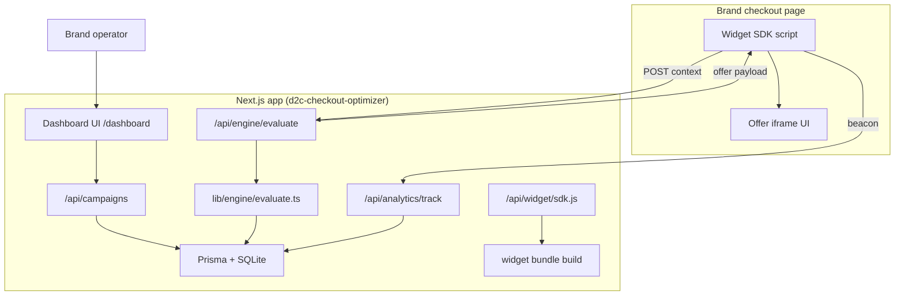

# Dynamic Checkout-Stage Price Optimization Engine

**Project:** `d2c-checkout-optimizer`  
**Status:** Planning — awaiting green light before implementation  
**Last updated:** 2026-05-26

---

## 1. Workspace audit (current state)

| Area | State |
|------|--------|
| **Location** | `/Users/mayankdharaskar/d2c-checkout-optimizer` (git initialized) |
| **Framework** | Next.js **16.2.6** App Router (meets 14+ requirement) |
| **UI** | React 19, Tailwind CSS **v4** (`@import "tailwindcss"`) |
| **ORM** | Prisma **7.8** — SQLite via `DATABASE_URL="file:./dev.db"` |
| **Prisma client** | Generated to `src/generated/prisma` (configured, not yet generated) |
| **App code** | Default scaffold only: `src/app/page.tsx`, `layout.tsx`, `globals.css` |
| **Database models** | None — `prisma/schema.prisma` has generator + datasource only |
| **API / dashboard / widget** | Not started |
| **Auth** | Not present (required for multi-tenant SaaS — see §4) |

**Implication:** Greenfield build on a valid stack. No conflicting legacy code. Prisma 7 uses `prisma.config.ts` + `dotenv` (already wired).

---

## 2. Product & technical goals

Build a **multi-tenant SaaS** where D2C brands:

1. Sign in and configure **campaigns** (rules + triggers + offers).
2. Embed a **lightweight widget** on checkout pages via a script tag.
3. The widget sends **browser context** to a fast **evaluate** endpoint and shows a margin-safe offer in an **iframe** (isolated styles, no checkout breakage).
4. **Analytics beacons** record impressions, accepts, and abandonments for ROI dashboards.

**Non-negotiables from spec:**

- Strict TypeScript — **no `any`**
- Prisma models map to API DTOs via shared `src/types/` + Zod (or equivalent) validators
- `/api/engine/evaluate` must be **lean and fast** (indexed queries, minimal joins, early exits)
- Widget **fails silently** on any error (try/catch, no thrown errors to host page)

---

## 3. High-level architecture



**Tenant boundary:** Every `Campaign`, `Offer`, and `AnalyticsEvent` is scoped by `storeId`. Public widget calls authenticate via **`storePublicKey`** (query param or header), not session cookies.

**Auth strategy (MVP, pragmatic):**

- **Dashboard:** NextAuth.js v5 (Auth.js) with Credentials provider for MVP (email + password on `User`), or magic link later.
- **Widget / engine:** `X-Store-Key: <publicKey>` validated on each request; `publicKey` is rotatable from dashboard.
- **Row-level security:** All Prisma queries include `where: { storeId }` from resolved session or store key.

---

## 4. Data model (`prisma/schema.prisma`)

### 4.1 Enums (SQLite: stored as `String` with Prisma `enum` or const unions in TS)

| Enum | Values |
|------|--------|
| `TriggerType` | `EXIT_INTENT`, `IDLE_TIME` |
| `OfferType` | `SHIPPING_DISCOUNT`, `FREE_GIFT_SKU`, `FIXED_DISCOUNT`, `EXPRESS_SHIPPING_UPGRADE` |
| `CampaignStatus` | `DRAFT`, `ACTIVE`, `PAUSED`, `ARCHIVED` |
| `AnalyticsEventType` | `IMPRESSION`, `OFFER_SHOWN`, `OFFER_ACCEPTED`, `OFFER_DISMISSED`, `CHECKOUT_COMPLETED`, `ABANDONMENT` |

### 4.2 Entities

```
User
├── id, email, passwordHash, name, createdAt, updatedAt
└── stores Store[]

Store (tenant)
├── id, name, slug, publicKey (unique), domain (optional allowlist)
├── ownerId → User
├── campaigns Campaign[]
└── analyticsEvents AnalyticsEvent[]

Campaign
├── id, storeId, name, status, priority (Int, higher wins)
├── minCartCents, maxCartCents (nullable = no cap)
├── geoCountries (JSON string: ISO codes, empty = all)
├── triggerType, idleSeconds (nullable unless IDLE_TIME)
├── marginFloorPercent (optional guardrail)
├── offerId → Offer (1:1 for MVP; 1:N later)
├── startsAt, endsAt (nullable)
└── @@index([storeId, status])

Offer
├── id, storeId, type (OfferType)
├── title, description, ctaLabel
├── payloadJson (typed per OfferType — see §6.3)
└── maxRedemptionsPerSession (default 1)

AnalyticsEvent
├── id, storeId, campaignId?, offerId?, sessionId
├── eventType, cartCents, country, metadataJson
├── createdAt
└── @@index([storeId, createdAt]), @@index([campaignId, eventType])
```

### 4.3 Seed data (dev)

- 1 demo user + store with known `publicKey`
- 2–3 sample campaigns (exit-intent vs idle, different cart bands)
- Sample analytics events for dashboard charts

---

## 5. Target file tree (full layout)

```text
d2c-checkout-optimizer/
├── .cursor/plans/
│   └── checkout-optimizer.md          # this document
├── prisma/
│   ├── schema.prisma                  # full schema (§4)
│   ├── migrations/                    # generated
│   └── seed.ts
├── public/
│   └── (static assets if needed)
├── scripts/
│   └── build-widget.ts                # esbuild → public or API-served bundle
├── src/
│   ├── generated/prisma/              # prisma generate (gitignored)
│   ├── app/
│   │   ├── layout.tsx
│   │   ├── page.tsx                   # marketing landing → link to dashboard
│   │   ├── globals.css
│   │   ├── (auth)/
│   │   │   ├── login/page.tsx
│   │   │   └── register/page.tsx
│   │   ├── dashboard/
│   │   │   ├── layout.tsx             # sidebar shell
│   │   │   ├── page.tsx               # analytics overview
│   │   │   ├── campaigns/
│   │   │   │   ├── page.tsx           # list
│   │   │   │   ├── new/page.tsx       # wizard
│   │   │   │   └── [id]/edit/page.tsx
│   │   │   └── settings/
│   │   │       └── page.tsx           # embed snippet, rotate publicKey
│   │   ├── widget/
│   │   │   └── frame/page.tsx         # iframe-hosted offer UI (Tailwind)
│   │   └── api/
│   │       ├── auth/[...nextauth]/route.ts
│   │       ├── campaigns/
│   │       │   ├── route.ts             # GET list, POST create
│   │       │   └── [id]/route.ts        # GET, PATCH, DELETE
│   │       ├── engine/
│   │       │   └── evaluate/route.ts    # POST public evaluate
│   │       ├── analytics/
│   │       │   └── track/route.ts       # POST beacon
│   │       └── widget/
│   │           └── sdk/route.ts         # GET application/javascript
│   ├── components/
│   │   ├── ui/                          # reusable primitives
│   │   │   ├── button.tsx
│   │   │   ├── card.tsx
│   │   │   ├── input.tsx
│   │   │   ├── label.tsx
│   │   │   ├── select.tsx
│   │   │   ├── badge.tsx
│   │   │   ├── table.tsx
│   │   │   └── skeleton.tsx
│   │   ├── dashboard/
│   │   │   ├── sidebar.tsx
│   │   │   ├── stat-card.tsx
│   │   │   ├── analytics-overview.tsx
│   │   │   ├── campaign-table.tsx
│   │   │   ├── campaign-wizard/
│   │   │   │   ├── step-conditions.tsx
│   │   │   │   ├── step-triggers.tsx
│   │   │   │   ├── step-offer.tsx
│   │   │   │   └── step-review.tsx
│   │   │   └── embed-snippet.tsx
│   │   └── layout/
│   │       └── dashboard-header.tsx
│   ├── lib/
│   │   ├── prisma.ts                    # singleton client
│   │   ├── auth.ts                      # NextAuth config
│   │   ├── session.ts                   # getServerSession helpers
│   │   ├── api/
│   │   │   ├── response.ts              # typed JSON helpers
│   │   │   └── store-key.ts             # validate public key
│   │   ├── engine/
│   │   │   ├── evaluate.ts              # core matching algorithm
│   │   │   ├── scoring.ts               # priority + specificity score
│   │   │   └── guards.ts                # margin/cart/geo checks
│   │   ├── analytics/
│   │   │   └── aggregates.ts            # AOV lift, recovered revenue SQL
│   │   └── validators/
│   │       ├── campaign.ts
│   │       ├── evaluate.ts
│   │       └── analytics.ts
│   ├── types/
│   │   ├── campaign.ts
│   │   ├── offer.ts
│   │   ├── engine.ts
│   │   └── analytics.ts
│   └── widget/
│       ├── sdk.ts                       # entry: init, listeners, API calls
│       ├── triggers/
│       │   ├── exit-intent.ts
│       │   └── idle-timer.ts
│       ├── transport/
│       │   ├── evaluate.ts
│       │   └── track.ts                 # sendBeacon + fetch fallback
│       ├── ui/
│       │   └── mount-iframe.ts
│       └── types.ts
├── package.json                         # + next-auth, bcrypt, zod, esbuild
├── tsconfig.json
├── prisma.config.ts
└── .env.example
```

---

## 6. API contracts (typed)

### 6.1 `POST /api/engine/evaluate`

**Auth:** `X-Store-Key`  
**Body:**

```ts
{
  sessionId: string;
  trigger: "EXIT_INTENT" | "IDLE_TIME";
  cartTotalCents: number;
  currency: string;           // default "USD"
  country: string;            // ISO 3166-1 alpha-2
  durationOnPageMs: number;
  items?: { sku: string; qty: number; priceCents: number }[];
}
```

**Response (200):**

```ts
{
  matched: boolean;
  campaignId?: string;
  offer?: {
    id: string;
    type: OfferType;
    title: string;
    description: string;
    ctaLabel: string;
    payload: OfferPayload;    // discriminated union
    frameUrl: string;         // /widget/frame?...
  };
}
```

**Performance budget:** p95 &lt; 50ms local; single Prisma query for active campaigns + in-memory filter; no N+1.

### 6.2 `POST /api/analytics/track`

**Auth:** `X-Store-Key`  
**Body:** `{ sessionId, eventType, campaignId?, offerId?, cartCents?, country?, metadata? }`  
**Response:** `204 No Content` (fire-and-forget; queue optional later)

### 6.3 `OfferPayload` (discriminated union)

| `OfferType` | Payload fields |
|-------------|----------------|
| `SHIPPING_DISCOUNT` | `discountCents`, `minCartCents?` |
| `FREE_GIFT_SKU` | `sku`, `giftTitle` |
| `FIXED_DISCOUNT` | `discountCents`, `couponCode?` |
| `EXPRESS_SHIPPING_UPGRADE` | `upgradeLabel` |

### 6.4 `/api/campaigns` (dashboard, session auth)

Standard REST: list with `?status=`, create, update, delete. Responses use shared `CampaignWithOffer` type.

---

## 7. Evaluation algorithm (`lib/engine/evaluate.ts`)

**Steps (in order, all sync after DB fetch):**

1. Load `ACTIVE` campaigns for `storeId` where `now` ∈ [startsAt, endsAt], ordered by `priority DESC`.
2. **Filter** in memory:
   - `cartTotalCents` ∈ [minCart, maxCart]
   - `country` in `geoCountries` (or empty list = worldwide)
   - `trigger` matches request (`IDLE_TIME` also checks `durationOnPageMs >= idleSeconds * 1000`)
3. **Score** survivors: `priority * 1000 + specificity` (narrower cart band + geo match = higher specificity).
4. Pick top campaign; attach `Offer`; build `frameUrl` with signed query params (HMAC optional in v2).
5. Return `matched: false` if none — widget does nothing.

**Margin guard (MVP):** If `marginFloorPercent` set, reject offer when `discountCents / cartTotalCents` exceeds `(100 - marginFloor) / 100` (configurable formula documented in code).

---

## 8. Widget SDK design

### 8.1 Embed snippet (dashboard settings)

```html
<script
  async
  src="https://{APP_URL}/api/widget/sdk?key=STORE_PUBLIC_KEY"
  data-checkout-optimizer
></script>
```

### 8.2 Runtime behavior

1. `sdk.ts` reads `key` from script URL; generates persistent `sessionId` in `sessionStorage`.
2. Registers **exit-intent** (mouse Y &lt; 10, velocity upward) and **idle timer** (default 45s, configurable via `data-idle-seconds`).
3. On trigger → debounced `evaluate` call (max 1 in-flight).
4. On match → inject iframe pointing to `/widget/frame?...`; postMessage for accept/dismiss.
5. On show/accept/dismiss → `navigator.sendBeacon` to `/api/analytics/track`.
6. **All paths wrapped in try/catch** — errors logged to `console.debug` only if `data-debug`.

### 8.3 Build & delivery

- **esbuild** bundles `src/widget/sdk.ts` → IIFE &lt; 8KB gzipped target.
- Served via `GET /api/widget/sdk` with `Cache-Control: public, max-age=3600`.
- iframe page is a normal Next.js route (full Tailwind) — isolated from host CSS.

---

## 9. Dashboard UI scope

### 9.1 Analytics overview (`/dashboard`)

| Card | Calculation (MVP) |
|------|-------------------|
| **AOV Lift** | avg cart on `OFFER_ACCEPTED` vs baseline sessions without offer |
| **Recovered Revenue** | sum `cartCents` on accepted offers (proxy) |
| **Conversion Rate** | `OFFER_ACCEPTED / OFFER_SHOWN` |
| **With vs Without** | compare `CHECKOUT_COMPLETED` with `campaignId` set vs null |

Charts: 7-day impression/accept trend (simple CSS bars or lightweight chart lib — **defer recharts** unless needed).

### 9.2 Campaign builder wizard

| Step | Fields |
|------|--------|
| **Conditions** | name, min/max cart, multi-select countries |
| **Triggers** | exit-intent OR idle (+ seconds, default 45) |
| **Offer** | type selector + dynamic payload form |
| **Review** | summary + activate |

Validation: Zod schemas shared with API.

### 9.3 Settings

- Display embed code copy button
- Rotate `publicKey` (invalidates old embeds)

---

## 10. Dependencies to add (implementation phase)

| Package | Purpose |
|---------|---------|
| `zod` | Request/response validation |
| `next-auth@beta` | Dashboard auth |
| `bcryptjs` + `@types/bcryptjs` | Password hashing |
| `esbuild` | Widget bundle |
| `clsx` + `tailwind-merge` | UI class utilities |
| `dotenv` | Already used by Prisma config |

**Optional (post-MVP):** `@tanstack/react-query`, `recharts`, rate limiting (`@upstash/ratelimit`).

---

## 11. Implementation phases & task breakdown

Each phase ends with a **verification gate**. Do not start the next phase until the current gate passes.

### Phase 0 — Foundation & tooling
| # | Task | Files |
|---|------|-------|
| 0.1 | Install dependencies; add `.env.example` | `package.json`, `.env.example` |
| 0.2 | Prisma schema (§4); migrate; generate client | `prisma/schema.prisma`, `src/lib/prisma.ts` |
| 0.3 | Seed script + demo store/key | `prisma/seed.ts` |
| 0.4 | Shared types + Zod validators | `src/types/*`, `src/lib/validators/*` |
| 0.5 | API response helpers + store-key middleware | `src/lib/api/*` |

**Gate:** `npx prisma migrate dev` + `npm run build` succeed.

---

### Phase 1 — Auth & tenant context
| # | Task | Files |
|---|------|-------|
| 1.1 | NextAuth credentials provider | `src/lib/auth.ts`, `src/app/api/auth/[...nextauth]/route.ts` |
| 1.2 | Register/login pages | `src/app/(auth)/*` |
| 1.3 | `getStoreForUser()` session helper | `src/lib/session.ts` |
| 1.4 | Protect `/dashboard/*` via middleware | `src/middleware.ts` |

**Gate:** Login → access dashboard shell; unauthenticated redirect works.

---

### Phase 2 — Campaigns API
| # | Task | Files |
|---|------|-------|
| 2.1 | CRUD routes with Zod + Prisma | `src/app/api/campaigns/**` |
| 2.2 | Offer upsert on campaign create/update | same |
| 2.3 | Unit-style test script or manual API checklist | `scripts/test-campaigns.http` (optional) |

**Gate:** Create/list/update/delete campaign via API or dashboard form (Phase 3).

---

### Phase 3 — Dashboard UI
| # | Task | Files |
|---|------|-------|
| 3.1 | UI primitives | `src/components/ui/*` |
| 3.2 | Dashboard layout + sidebar | `src/app/dashboard/layout.tsx`, `src/components/dashboard/sidebar.tsx` |
| 3.3 | Campaign list + table | `src/app/dashboard/campaigns/page.tsx` |
| 3.4 | Campaign wizard (4 steps) | `src/app/dashboard/campaigns/new/*`, `src/components/dashboard/campaign-wizard/*` |
| 3.5 | Settings + embed snippet | `src/app/dashboard/settings/page.tsx` |
| 3.6 | Landing page CTA | `src/app/page.tsx` |

**Gate:** Full campaign lifecycle from UI without touching DB manually.

---

### Phase 4 — Engine & analytics backend
| # | Task | Files |
|---|------|-------|
| 4.1 | `evaluate.ts` algorithm + guards | `src/lib/engine/*` |
| 4.2 | `POST /api/engine/evaluate` | `src/app/api/engine/evaluate/route.ts` |
| 4.3 | `POST /api/analytics/track` | `src/app/api/analytics/track/route.ts` |
| 4.4 | Aggregates for dashboard cards | `src/lib/analytics/aggregates.ts` |
| 4.5 | Wire analytics overview | `src/app/dashboard/page.tsx`, `src/components/dashboard/analytics-overview.tsx` |

**Gate:** curl evaluate with seed store key returns offer; track events appear in DB; dashboard shows non-zero stats.

---

### Phase 5 — Widget SDK & iframe
| # | Task | Files |
|---|------|-------|
| 5.1 | Widget modules (triggers, transport, mount) | `src/widget/**` |
| 5.2 | esbuild script + npm script | `scripts/build-widget.ts`, `package.json` |
| 5.3 | Serve bundle | `src/app/api/widget/sdk/route.ts` |
| 5.4 | iframe offer page | `src/app/widget/frame/page.tsx` |
| 5.5 | postMessage accept/dismiss → analytics | widget + frame |

**Gate:** Static HTML test page loads SDK, triggers offer, accept fires `OFFER_ACCEPTED` without host page errors.

---

### Phase 6 — Hardening & polish
| # | Task | Files |
|---|------|-------|
| 6.1 | CORS headers for widget origin (configurable per store domain) | API routes |
| 6.2 | Rate limit evaluate (IP + store key) — simple in-memory MVP | middleware or route |
| 6.3 | ESLint strict: no explicit any | project-wide |
| 6.4 | README: setup, embed, env vars | `README.md` |
| 6.5 | `npm run build` + smoke test checklist | — |

**Gate:** Production build clean; widget failure modes tested (invalid key, 500, offline).

---

## 12. Execution order (sequential file creation)

When approved, implement **in this exact order** (one PR-sized chunk at a time):

1. `prisma/schema.prisma` → migrate → `src/lib/prisma.ts` → seed  
2. `src/types/*` + `src/lib/validators/*`  
3. `src/lib/api/*` + `src/lib/engine/*` (stubs OK until Phase 4)  
4. Auth stack → middleware → auth pages  
5. `src/app/api/campaigns/**`  
6. `src/components/ui/**` → dashboard layout → campaigns UI  
7. `src/app/api/engine/evaluate/route.ts` + `src/app/api/analytics/track/route.ts`  
8. `src/lib/analytics/aggregates.ts` → dashboard analytics page  
9. `src/widget/**` → build script → `src/app/api/widget/sdk/route.ts` → `src/app/widget/frame/page.tsx`  
10. README + final QA  

---

## 13. Risks & decisions (confirm before coding)

| Topic | Proposal | Alternative |
|-------|----------|-------------|
| **Auth** | NextAuth credentials MVP | Clerk / Auth0 later |
| **Widget key** | Long-lived `publicKey` in script URL | JWT per session (more secure, heavier) |
| **Offer application** | Display + coupon code only (brand applies in their cart) | Deep Shopify integration (out of scope MVP) |
| **SQLite** | Dev/small tenants | Postgres for production (schema-compatible) |
| **Next 16 vs 14** | Keep current 16.x | Pin to 14 if deployment requires |

---

## 14. Out of scope (MVP)

- Shopify / WooCommerce native apps  
- A/B test bucketing across campaigns  
- Real-time websockets  
- Billing / Stripe subscriptions  
- Admin super-tenant console  

---

## 15. Approval checklist

Before implementation, confirm:

- [ ] File tree and folder conventions (`src/components/ui`, `src/lib/engine`, `src/widget`)  
- [ ] Data model (User → Store → Campaign → Offer → AnalyticsEvent)  
- [ ] Auth approach (NextAuth credentials + `publicKey` for widget)  
- [ ] API contracts (§6)  
- [ ] Phase order (§11) and gates  
- [ ] Any changes to offer types or trigger defaults  

---

## 16. Next step

**Waiting for your green light.** Reply with approval (or edits to this plan), then implementation will proceed **Phase 0 → Phase 6** sequentially without skipping gates.
